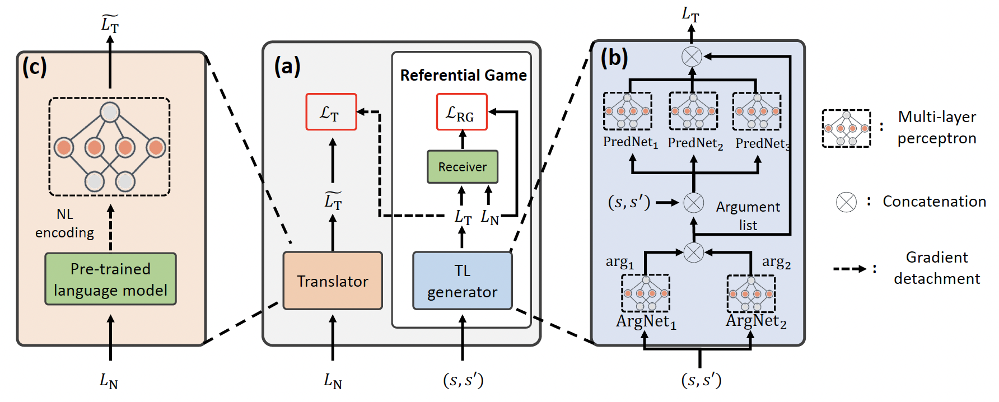

This blog introduces [our work](https://arxiv.org/abs/2302.09368) that will appear in NeurIPS 2023. 

## Abstract
Natural language-conditioned reinforcement learning (RL) enables agents to follow human instructions. Previous approaches generally implemented language-conditioned RL by providing the policy with human instructions in natural language (NL) and training the policy to follow instructions. In this is outside-in approach, the policy must comprehend the NL and manage the task simultaneously. However, the unbounded NL examples often bring much extra complexity for solving concrete RL tasks, which can distract policy learning from completing the task. To ease the learning burden of the policy, we investigate an inside-out scheme for natural language-conditioned RL by developing a task language (TL) that is task-related and easily understood by the policy, thus reducing the policy learning burden. Besides, we employ a translator to translate natural language into the TL, which is used in RL to achieve efficient policy training. We implement this scheme as TALAR (TAsk Language with predicAte Representation) that learns multiple predicates to model object relationships as the TL. Experiments indicate that TALAR not only better comprehends NL instructions but also leads to a better instruction-following policy that significantly improves the success rate over baselines and adapts to unseen expressions of NL instruction. Besides, the TL is also an effective sub-task abstraction compatible with hierarchical RL.

<!--more-->

## Method

## Performance

 | 
--- | ---